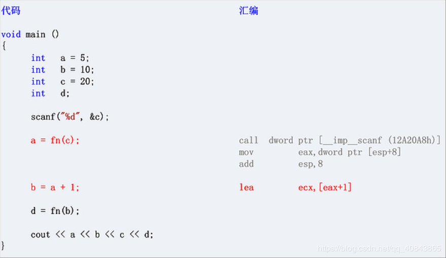
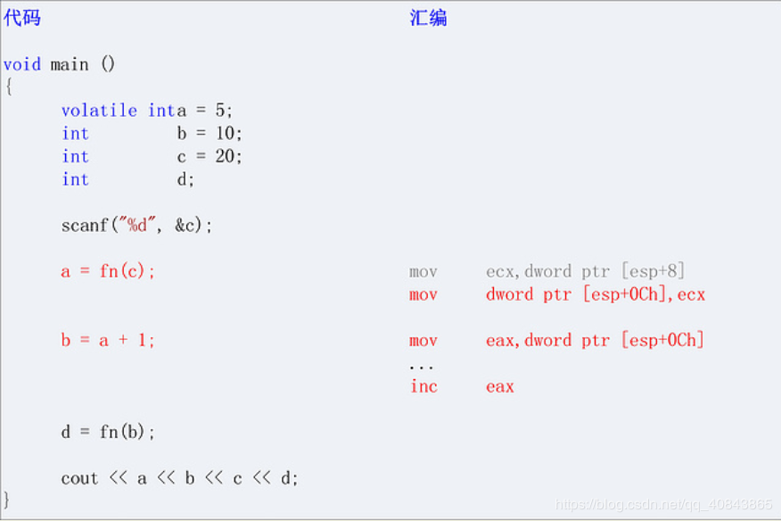
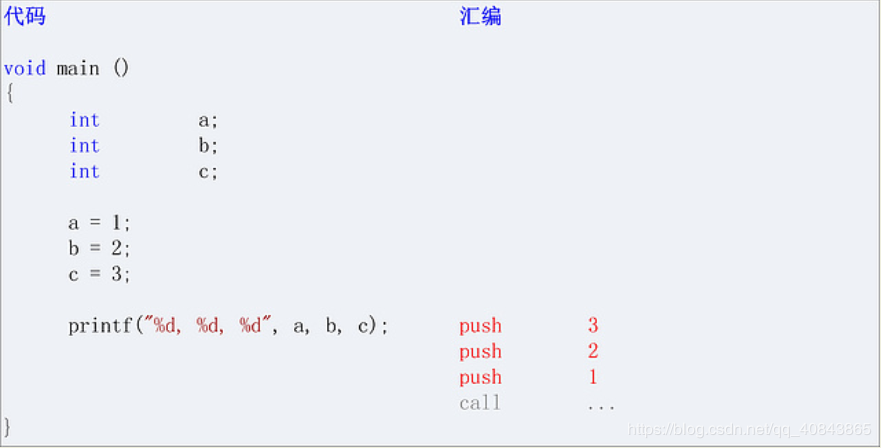

## [转载]官方解释：

​	**volatile**	作为指令关键字，确保本条指令不会因编译器的优化而被省略，即系统每次从变量所在内存读取数据而不是从寄存器读取备份。

## 易变性

编译器对volatile修饰的变量，当要读取这个变量时，任何情况下都会从内存中读取，而不会从寄存器缓存中读取（因为每次都从内存中读取体现出变量的“易变”）

**对于非volatile变量**

对 b = a + 1;这条语句，对应的汇编指令是：lea ecx, [eax + 1]。
由于变量a，在前一条语句a = fn©执行时，被缓存在了寄存器eax中，因此b = a + 1；语句，可以直接使用仍旧在寄存器eax中的内容，来进行计算，对应的也就是汇编：[eax + 1]

**对于volatile型变量**

与测试用例一唯一的不同之处，是变量a被设置为volatile属性，一个小小的变化，带来的是汇编代码上很大的变化。a = fn©执行后，寄存器ecx中的a，被写回内存：mov dword ptr [esp+0Ch], ecx。然后，在执行b = a + 1；语句时，变量a有重新被从内存中读取出来：mov eax, dword ptr [esp + 0Ch]，而不再直接使用寄存器ecx中的内容

## 不可优化性

编译器不会对volatile修饰的变量进行任何优化

**对于非volatile变量**

在这个用例中，非volatile变量a，b，c全部被编译器优化掉了 (optimize out)，因为编译器通过分析，发觉a，b，c三个变量直接用立即数替换，不必存在内存中。最后的汇编代码相当简介，高效率

在这个用例中，非volatile变量a，b，c全部被编译器优化掉了 (optimize out)，因为编译器通过分析，发觉a，b，c三个变量直接用立即数替换，不必存在内存中。最后的汇编代码相当简介，高效率

**对于volatile变量**

在这个用例中，a、b、c三个变量，都是volatile变量。在汇编语言中，这三个变量存到了内存中，在使用a、b、c时需要将三个变量从内存读入到寄存器之中，然后再调用printf()函数

## 顺序性

程序的乱序优化：保证一段代码的输出结果的前提下，将各条代码的实际执行顺序进行优化调整

volatile变量与volatile变量间代码的顺序，编译器不会进行乱序优化，但是volatile变量与非volatile变量代码的顺序，编译器不保证顺序，可能会进行乱序优化