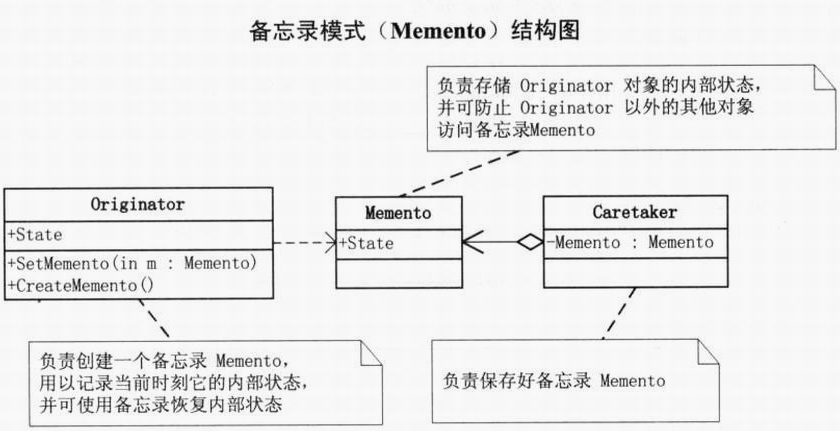

# 备忘录模式


## 定义

在不破坏封装性的前提下，补获一个对象的内部状态，并在该对象之外保存这个状态。这样以后就可将该对象恢复到原先保存的状态。




## 代码

```c++
#include<iostream>
#include<string>
using namespace std;

class Memento
{
private:
	string state;
public:
	Memento(string state):state(state) {

	}
	string getState() {
		return state;
	}
};

class Originator
{
private:
	string state;
public:
	void setState(string state) {
		this->state = state;
	}
	string getState() {
		return state;
	}
	Memento* createMemento() {
		return new Memento(state);
	}
	void setMemento(Memento *mem) {
		state = mem->getState();
	}
	void show() {
		cout << "state = " << state << endl;
	}
};

class CareTaker {
private:
	Memento *mem;
public:
	void setMemento(Memento *val) {
		mem = val;
	}
	Memento* getMemento() {
		return mem;
	}
};

int main() {

	Originator *ori = new Originator();
	ori->setState("On");
	ori->show();

	CareTaker *c = new CareTaker();
	c->setMemento(ori->createMemento());

	ori->setState("off");
	ori->show();

	ori->setMemento(c->getMemento());
	ori->show();

	return 0;
}
```

