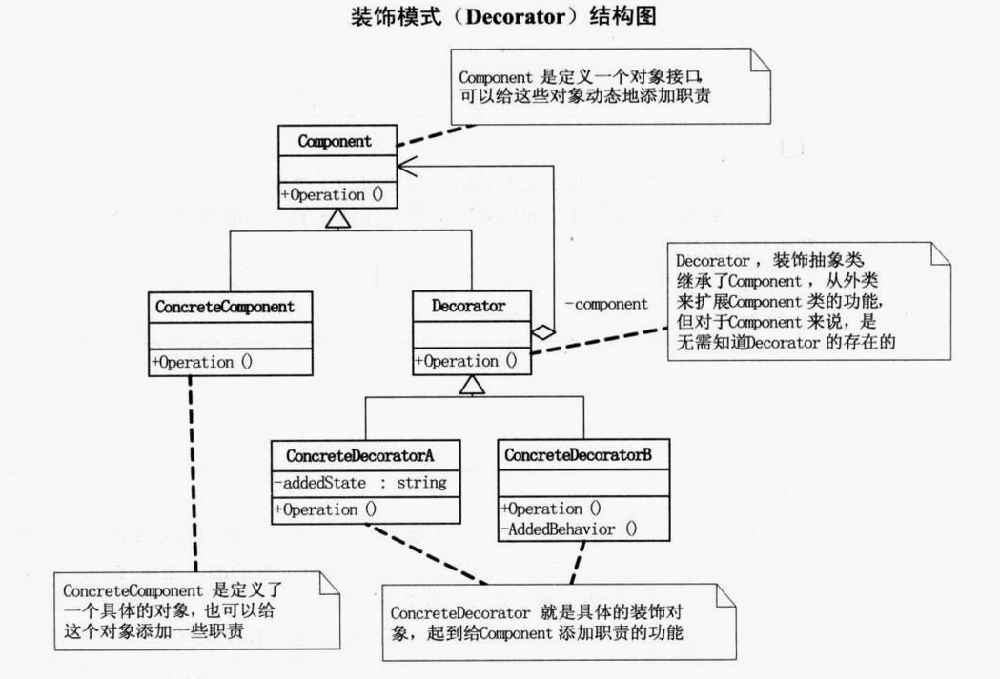

# 装饰模式


## 定义：

**动态地给一个对象添加一些额外的职责，就增加功能来说，装饰模式比生成子类更加灵活。**



## 优点：

**把类中的装饰功能从类中搬移去除，这样可以简化原有的类。**


## 代码：

```
#include<iostream>

using namespace std;

class Component 
{
public:
	virtual void operation() {}
};

class ConcreteComponent :public Component 
{
public:
	void operation() override {
		cout << "具体对象的操作" << endl;
	}
};

class Decorator : public Component
{
public:
	void  setComponent(Component *component) {
		this->component = component;
	}

	void operation() override {
		if (component) component->operation();
	}
protected:
	Component *component;
};

class ConcreteDecoratorA : public Decorator
{
public:
	void operation() override {
		__super::operation();
		addedState = "New State";
		cout << "具体装饰对象A的操作" << endl;
	}
private:
	string addedState;
};

class ConcreteDecoratorB : public Decorator
{
public:
	void operation() override {
		__super::operation();
		addedBehavior();
		cout << "具体装饰对象B的操作" << endl;
	}
private:
	void addedBehavior() {
		cout << "这是B 独有的函数" << endl;
	}
};

int main() {
	ConcreteComponent *c = new ConcreteComponent();
	ConcreteDecoratorA *d1 = new ConcreteDecoratorA();
	ConcreteDecoratorB *d2 = new ConcreteDecoratorB();

	d1->setComponent(c);
	d2->setComponent(d1);
	d2->operation();

	delete d2;
	delete d1;
	delete c;

	return 0;
}

```

