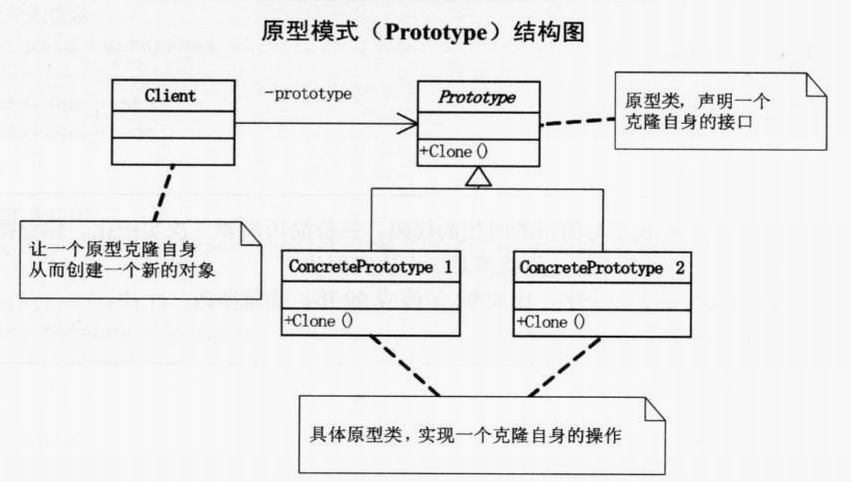

# 原型模式


## 定义：

 

***用原型实例制定创建对象的种类，并且通过拷贝这些原型创建新的对象。***




## 代码：

```c++
#include<iostream>
#include <string>
using namespace std;

class Prototype
{
public:
	Prototype(){}
	virtual ~Prototype(){}
	virtual Prototype* clone() { return nullptr; }
	string getID() {
		return id;
	}
protected:
	string id;
};

class Student : public Prototype
{
public:
	Student(string id) { this->id = id; };
	Prototype* clone() override { return new Student(*this); }
	string getID() {
		return id;
	}
private:
	Student(const Student &tmp) {
		this->id = tmp.id;
	}
};

int main() {
	Prototype *stu = new Student("1994");
	Prototype *tmp = stu->clone();
	cout << tmp->getID()<<endl;
	delete tmp;
	return 0;
}
```

