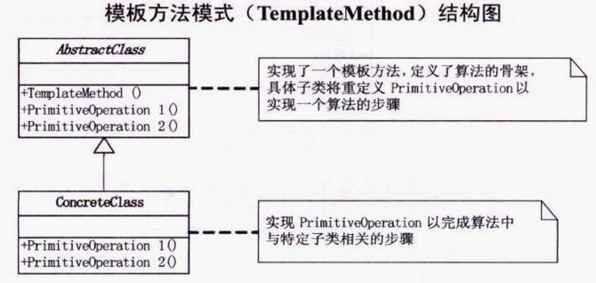

# 模板方法模式


## 定义


**定义一个操作中的算法骨架，而将一些步骤延迟到子类中。模板方法使得子类可以不改变算法的结构即可重定义该算法的某些特定步骤**




## 代码

```c++
#include <iostream>

using namespace std;

class AbstractClass
{
public:
	void templateMethod() {
		primitiveOperation1();
		primitiveOperation2();
	}
protected:
	virtual void primitiveOperation1() {};
	virtual void primitiveOperation2() {};
	
};

class ConcreteClassA : public AbstractClass
{
protected:
	void primitiveOperation1() override {
		cout << "具体类A方法1实现" << endl;
	}
	void primitiveOperation2() override {
		cout << "具体类A方法2实现" << endl;
	}
};
class ConcreteClassB : public AbstractClass
{
protected:
	void primitiveOperation1() override {
		cout << "具体类B方法1实现" << endl;
	}
	void primitiveOperation2() override {
		cout << "具体类B方法2实现" << endl;
	}
};

int main() {
	AbstractClass *c = new ConcreteClassA();
	c->templateMethod();
	delete c;
	c = new ConcreteClassB();
	c->templateMethod();

	delete c;
	return 0;
}
```

